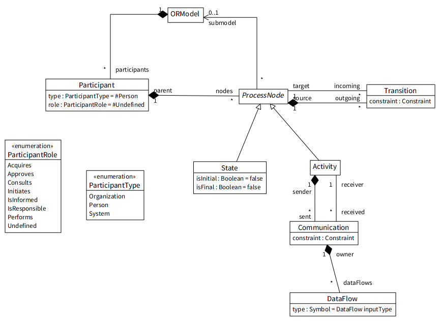

# BORM model
[](https://travis-ci.org/OpenPonk/class-editor) [](https://coveralls.io/github/OpenPonk/class-editor?branch=master)


Smalltalk meta-model for BORM http://ccmi.fit.cvut.cz/methodologies/borm/



For editor see [borm-editor](https://github.com/dynacase/borm-editor)

## Installation

```
Metacello new
	baseline: 'BormModel';
	repository: 'github://dynacase/borm-editor/repository';
	load.
```
